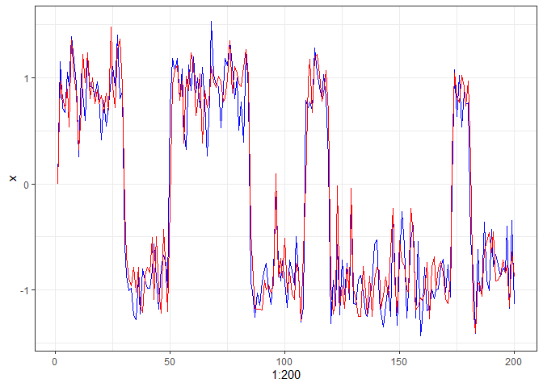
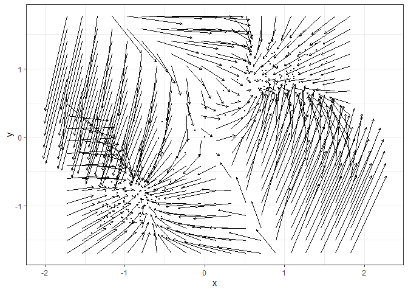
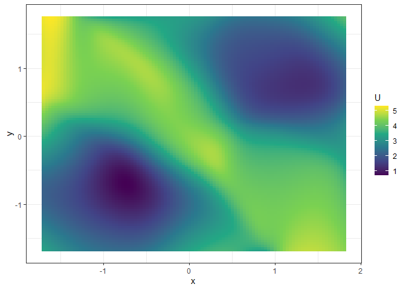

<!-- README.md is generated from README.Rmd. Please edit that file -->

# `fitlandr`: Fit Vector Fields and Potential Landscapes from Intensive Longitudinal Data 

<!-- badges: start -->

[](https://cran.r-project.org/package=fitlandr)

[](https://cran.r-project.org/package=fitlandr)
[](https://github.com/Sciurus365/fitlandr/actions/workflows/R-CMD-check.yaml)
<!-- badges: end -->

A toolbox for estimating vector fields from intensive longitudinal data
and constructing potential landscapes. Vector fields can be estimated
with two nonparametric methods: the Multivariate Vector Field Kernel
Estimator (MVKE) by Bandi & Moloche (2018)
<https://doi.org/10.1017/S0266466617000305> and the Sparse Vector Field
Consensus (SparseVFC) algorithm by Ma et al. (2013)
<https://doi.org/10.1016/j.patcog.2013.05.017>.

In the current recommended workflow, landscapes are built from the
estimated vector field by numerically solving for the steady-state
distribution with a finite-difference method, and then transforming this
distribution into potential values. Earlier wrapper-based routes (e.g.,
the previous `pathB`/`simlandr`-based workflow) are deprecated.

## Installation

You can install the development version of `fitlandr` from
[GitHub](https://github.com/) with:

``` r
# install.packages("devtools")
devtools::install_github("Sciurus365/fitlandr")
```

## Example

We use the following bistable dynamic system to illustrate the use of
`fitlandr`. The test data set is created as follows.

``` r
single_output_grad <- simlandr::sim_fun_grad(length = 200, seed = 1614)

library(tidyverse)
ggplot(data = single_output_grad %>% as_tibble()) +
  geom_path(aes(x = 1:200, y = x), color = "blue") +
  geom_path(aes(x = 1:200, y = y), color = "red") +
  theme_bw()
```



Fit the vector field with MVKE (see `?MVKE` for parameter details):

``` r
library(fitlandr)
v2 <- fit_2d_vf(single_output_grad, x = "x", y = "y", method = "MVKE")
autoplot(v2)
```



For intensive longitudinal psychological data, `method = "MVKE"` is the
preferred default because it typically gives more realistic drift
estimates for observations farther from equilibrium regions (basins).

Fit the potential landscape:

The current `make_2d_ld()` pipeline takes the fitted vector field and
computes a steady-state distribution numerically using a finite-
difference scheme, then converts it to a potential landscape.

``` r
set.seed(1614)
l2 <- make_2d_ld(v2, linear_interp = FALSE, n_grid = 100)
#> ℹ Setting up grid and pre-calculating fields...✔ Setting up grid and pre-calculating fields... [8.1s]
#> ℹ Building sparse matrix representation...✔ Building sparse matrix representation... [326ms]
#> ℹ Solving for steady-state distribution...✔ Solving for steady-state distribution... [72ms]
autoplot(l2)
# Use plotly_ld(l2) for the interactive 3D landscape.
```



``` r
# equivalent:
# l2 <- make_2d_ld(v2, linear_interp = FALSE)
```
