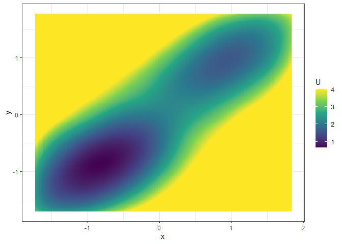

<!-- README.md is generated from README.Rmd. Please edit that file -->

# `fitlandr`: Fit Vector Fields and Potential Landscapes from Intensive Longitudinal Data 

<!-- badges: start -->

[](https://cran.r-project.org/package=fitlandr)

[](https://cran.r-project.org/package=fitlandr)
<!-- badges: end -->

A toolbox for estimating vector fields from intensive longitudinal data,
and construct potential landscapes thereafter. The vector fields can be
estimated with two nonparametric methods: the Sparse Vector Field
Consensus (SparseVFC) algorithm by Ma et al. (2013)
<doi:10.1016/j.patcog.2013.05.017> and the Multivariate Vector Field
Kernel Estimator (MVKE) by Bandi & Moloche (2018)
<doi:10.1017/S0266466617000305>. The potential landscapes are
constructed with a simulation-based approach with the `simlandr`
package.

## Installation

You can install the development version of `fitlandr` from
[GitHub](https://github.com/) with:

``` r
# install.packages("devtools")
devtools::install_github("Sciurus365/fitlandr")
```

## Example

We use the following bistable dynamic system to illustrate the use of
`fitlandr`. The test data set is created as follows.

``` r
single_output_grad <- simlandr::sim_fun_grad(length = 100, seed = 1614)

library(tidyverse)
ggplot(data = single_output_grad %>% as_tibble()) +
    geom_path(aes(x = 1:100, y = x), color = "blue") +
    geom_path(aes(x = 1:100, y = y), color = "red") +
    theme_bw()
```


Fit the vector field of the system with VFC (see `?SparseVFC::SparseVFC`
for the explanations of parameters):

``` r
library(fitlandr)
v1 <- fit_2d_vf(single_output_grad, x = "x", y = "y", method = "VFC", silent = FALSE, beta = 2)
#> Start mismatch removal...
#> iterate: 1th, gamma: 0.900000, the energy change rate: 1.007436, sigma2=0.124921
#> iterate: 2th, gamma: 0.939394, the energy change rate: 0.386473, sigma2=0.041065
#> iterate: 3th, gamma: 0.929293, the energy change rate: 0.039469, sigma2=0.032124
#> iterate: 4th, gamma: 0.929293, the energy change rate: 0.006939, sigma2=0.030121
#> iterate: 5th, gamma: 0.929293, the energy change rate: 0.001070, sigma2=0.029739
#> iterate: 6th, gamma: 0.929293, the energy change rate: 0.000214, sigma2=0.029658
#> iterate: 7th, gamma: 0.929293, the energy change rate: 0.000046, sigma2=0.029640
#> iterate: 8th, gamma: 0.929293, the energy change rate: 0.000010, sigma2=0.029636
#> iterate: 9th, gamma: 0.929293, the energy change rate: 0.000002, sigma2=0.029635
#> Removing outliers succesfully completed.
plot(v1)
```


Fit the potential landscape:

``` r
future::plan("multisession")
set.seed(1614)
l1 <- fit_2d_vfld(v1, .sim_vf_options = sim_vf_options(chains = 16), .simlandr_options = simlandr_options(adjust = 5, Umax = 5))
plot(l1, 2)
```


``` r
# equivalent:
# s1 <- sim_vf(v1, chains = 16)
# l1 <- simlandr::make_3d_static(s1, x = "x", y = "y", lims = c(v1$x_start, v1$x_end, v1$y_start, v1$y_end), adjust = 5, Umax = 5)
```

Fit the vector field with MVKE (see `?MVKE` for the explanations of
parameters):

``` r
v2 <- fit_2d_vf(single_output_grad, x = "x", y = "y", method = "MVKE")
plot(v2)
```


Fit the potential landscape:

``` r
set.seed(1614)
l2 <- fit_2d_vfld(v2, .sim_vf_options = sim_vf_options(noise = 0.2, chains = 16), .simlandr_options = simlandr_options(adjust = 5, Umax = 5))
plot(l2, 2)
```



``` r
# equivalent:
# s2 <- sim_vf(v2, noise = 0.2, chains = 16)
# l2 <- simlandr::make_3d_static(s2, x = "x", y = "y", lims = c(v2$x_start, v2$x_end, v2$y_start, v2$y_end), adjust = 5, Umax = 4)
```
